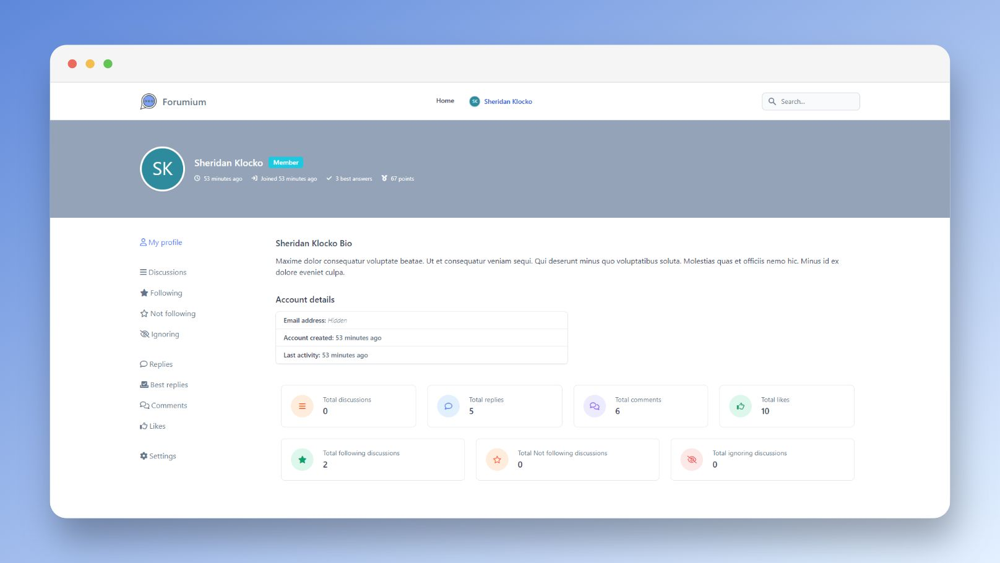
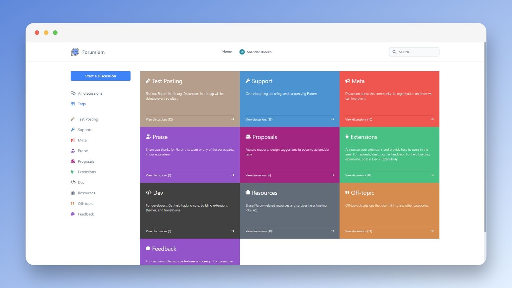
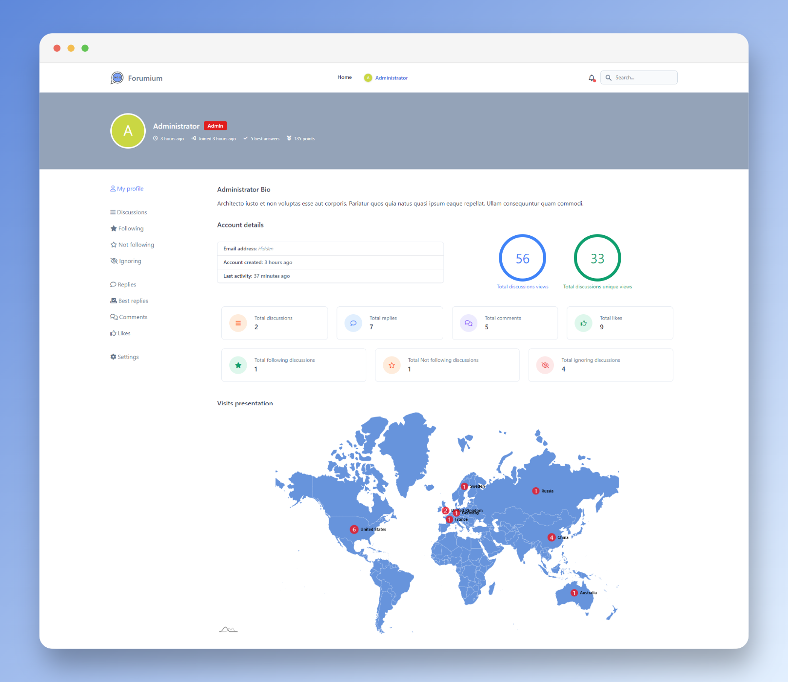

# Forumium

    
    
    
    
     
    
    
    
     
    

# Introduction

Forumium is a simple Forum platform made with the [**Laravel Framework**](https://laravel.com) and the elegant TALLkit [**Filament**](https://filamentphp.com/).

## Special mention

First of all, we must mention that the development of the **graphical part**, and what gave us the **majority of the development ideas**, was based on the Open Source [Flarum](https://flarum.org/) discussion system.

## Prerequisites

- Good knowledge of [Laravel](https://laravel.com/) Framework
- Good knowledge of [Filament](https://filamentphp.com/) TALLkit 

## Screenshots

    </img> 
    </img> 
    </img> 
    </img> 

## Documentation

Full documentation can be viewed online: [Docs](https://devaslanphp.github.io/forumium-docs)

## Work in progress

We are always working to make Forumium platform a better application, all contributions are welcome.

## Credits

- [All Contributors](https://github.com/devaslanphp/forumium/graphs/contributors)

## License

The MIT License (MIT). Please see [License File](LICENSE.md) for more information.

## Releases

- **Release 1.0.0** (January 5th, 2023)
  - The first stable release of Forumium

## Support us

